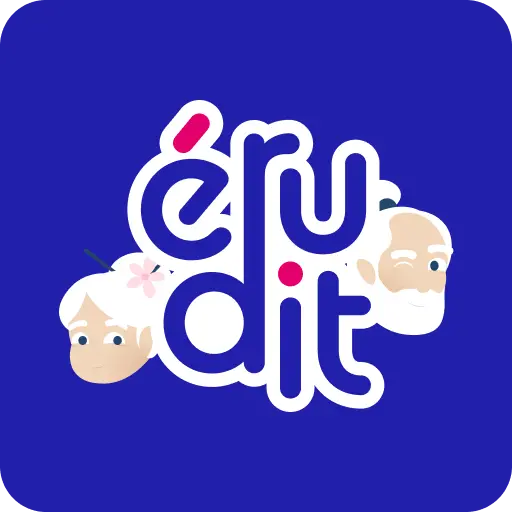

# Erudit Crowdfunding Campaign Plan

> My first steps with and without screens.

Erudit is an app that supports parents and children in their first steps with screens, through interactive cultural adventures that blend animation with real-world discovery.
We follow Eruh & Hudit, kindhearted grandparents with a passion for history and culture, and their grandson as they embark on countless adventures that help him learn, grow, and discover the world.

> All our illustrations, animations, and music are created by **true artists**, who are highlighted within the app.

---

## What do we do with Erudit ?

> Erudit is the experience we would love to share with our children. 

### Interactive animated stories

Each day, a short animated story of just a few minutes becomes available, centered on a cultural landmark. Through the adventures of our characters, the story brings the place’s history to life while gently conveying meaningful life lessons.

### Story review

Erudit's stories do not contain voices, a strong artistic choice, to open up dialogue between parents and children, and to highlight music as a way of evoking emotions.
Once the story is over, the anime is revisited scene by scene, to relive the important moments and better grasp the storyline.

### Knowledge quizzes

After watching the story, children and parents can go through short, playful quizzes that revisit the key moments of the episode.  
Each question is directly linked to a specific scene, helping children check their understanding, and encourage discussion around what they have just discovered.

### Spaced-repetition system

To help knowledge truly stick, Erudit uses a spaced-repetition system.
The app takes care of re-asking questions at smart, well-timed intervals, so cultural knowledge stays anchored in children’s minds for as long as possible.

### Location access & QR code scanning

Each story is rooted in a real cultural landmark. With a single tap, parents can open their map app to locate the site, plan a visit, explore nearby places, or simply connect the story to the real world.  
When families visit the location in real life and scan the QR code on site, they unlock Erudit’s secrets...

### Artist links

Erudit highlights their work by providing direct links to their websites, where families can discover the creators behind the stories.
Families can directly support the artists by purchasing the items or projects they offer.

### A smooth, safe and offline-first experience

All our stories are designed with ultra-smooth animations, reaching up to **120 frames per second**, to offer a seamless and immersive viewing experience.  
Erudit collects **no personal data** and works **entirely offline**, ensuring a safe, private, and accessible experience for children and families.

//todo: Add image after each list element.

## Why Create Erudit?

In a world saturated with screens, our goal is not to avoid them, but to teach children how to use them with intention and balance.  
Erudit is built on a simple belief: **digital tools should connect us, not isolate us**.

We imagine a generation for whom technology becomes a gateway to culture, imagination, and human values, not a source of dependency.

To support this, we bring together developers, illustrators, composers, storytellers, and animators to craft **a child’s first meaningful digital experience**, one that inspires wonder rather than dependency.

Erudit invites families to slow down, explore, and share a moment of discovery.  
It gently introduces essential digital tools while sparking real-world exploration and meaningful conversations.

More than an app, Erudit is a creative universe designed to help parents and children grow, learn, and open up to the world together.

---

## Erudit's Universe

* **Eruh**, the storyteller, shares his tales with passion, captivating the audience with unforgettable emotions and anecdotes.
* **Hudit**, the giver, turns these stories into carefully designed quizzes, helping everyone learn smoothly and remember more easily.

Centuries ago, Eruh and Hudit were part of a **secret ancient order**, the Guardians of History.
This order of scholars was tasked with protecting historical stories to ensure they would never be lost over time.

They believed that **well-preserved knowledge could guide future civilizations**, helping them avoid past mistakes and transmit noble values such as kindness, wisdom, and respect.

The members of this order possessed a mysterious power… but that’s for you to discover!

---

## What Are We Preparing for This First Edition?

For this first edition, we will focus on France, highlighting a story rooted in an iconic cultural location in **each of its regions**.
Each story will celebrate the richness and diversity of French heritage, revealing how history, art, and landscapes shape regional identities.
Every story will be **fully illustrated and set to music by local artists**, closely connected to the region they represent. These artists will be featured throughout the project:

- First, on social media through behind-the-scenes content and creative insights.
- Then, directly in the app, where each contributor is clearly credited for their work.

Based on the results and feedback from this first edition, the project can gradually expand—exploring **more regions & countries**, with the community helping to choose which places will be highlighted next.

---

## Why a Crowdfunding Campaign?

We made a conscious choice: **not to rely on AI**, but to collaborate with real artists, real hands, real sensibilities, to bring our animated stories to life.
This is **costly and hard to support at this stage**.
We need your support to **launch this beautiful project**, have enough content to generate early revenue, and increase visibility to attract public funding and partners.
By supporting us, you become a **co-producer of Erudit**, actively participating in our adventure while supporting the artists involved.

---

## How You Can Support Erudit

* **Fund the project** according to your means. Your support will be rewarded with **unique perks**, and you will follow the production step by step.
* **Spread the word** about Erudit to friends, family, and colleagues, and share our campaign on social media. Every share is a huge help!

---

## Rewards

*(List of reward tiers with images, e.g., digital cards, exclusive content, etc.)*

## Stretch Goals

*(What gets unlocked when funding milestones are reached)*

---

## Acknowledgements

Thanks to all the amazing people who have collaborated on this project. You make our life a dream.

### Artists

#### Artistic direction

[KALM DESIGN](https://www.instagram.com/kaelem_design/)

#### Illustrators

- [lesillustrationsdelou](https://lesillustrationsdelou.com)
- [Justine Ghyselen](https://www.instagram.com/justine.ghyselen)
- [Fooxyla](https://www.fooxyla.com)
- [Pollen Toxique](https://pollentoxique.myportfolio.com/)

#### Composers

[Marcos](https://www.fiverr.com/marcos_musika2)

#### Animators

- [Bobazanim](https://bobaz.fr)
- [Lala](https://www.fiverr.com/lurie_/)

### Organizations

[Live for Good](https://www.live-for-good.org)
The movement of young entrepreneurs who are changing the world.

### Contributors

[Papi-Eruh](https://github.com/Papi-Eruh)
