# Erudit Crowdfunding Campaign

**Go explore** our heritage with an **app that brings history to life** for family learning.

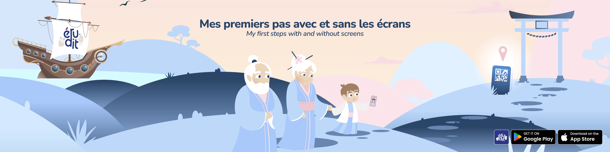

One afternoon, I found my grandson curled up on the couch, **eyes fixed on the television screen. Again.**

> **I don’t always know how to deal with screens**. How to accept them without letting them replace everything else.

When I suggested we go for a walk, he didn’t even answer. It hurt me. I took him with me anyway, and **brought him to a monument** he used to love when he was younger. This time, **he barely looked at it**.

It was in that moment of helplessness that **I noticed a small QR code nearby**. I didn’t realize **it would change our visit** that day.

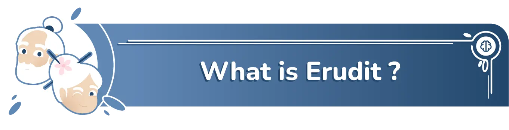

Erudit is a **mobile app** that tells the story of our heritage through animation and music, without words. It combines this with fun quizzes to make our history their own. This approach is designed to **introduce screen time gently**, creating a shared moment between children and parents.

In these **animated stories**, we follow **Eruh & Hudit**, kindhearted grandparents who can travel through time and space. Together with their grandson, they embark on countless adventures that help him learn, grow, and discover the world.

> We choose to **work only with real artists**, whom we proudly feature in the application.

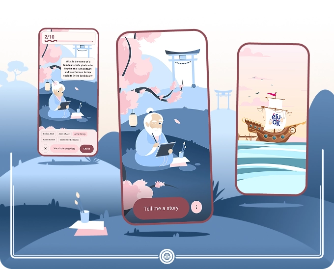

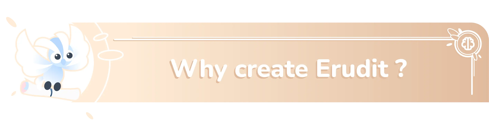

I have always been fascinated by **animated films and series**. Growing up, they were more than just entertainment, they fueled my dreams, gave me strong emotions, and taught me valuable life lessons. Creating my own animated universe has been a lifelong goal.

By focusing on **outdoor landmarks**, I want to use the screen to **reconnect children with the real world** around them.

Think of Erudit as a quiet bench. Sit side-by-side, slow down, and **turn screen time** into a shared moment of discovery and conversation.

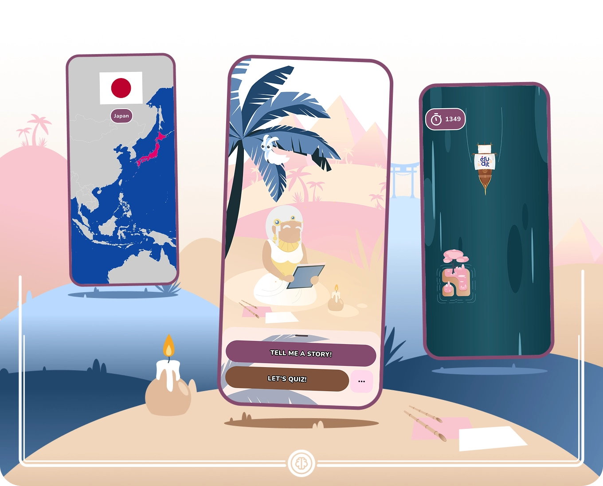

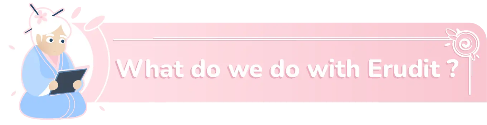

> Erudit is the experience we would **love to share with our children**.

### Watch History Come to Life

Visit cultural landmarks, **scan the QR code**, and watch **history come to life** right where it happened.

**For those at home**, Erudit ensures healthy screen time. We offer just **one short story per day**, allowing children to explore history and meaningful life lessons at a gentle pace.

While modern cartoons are often frantic, we choose calmness. **Our shots last at least six seconds**, giving children the time to watch, understand, and stay focused.

 

  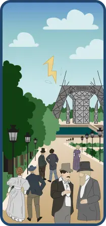
  &nbsp;&nbsp;&nbsp;&nbsp;
  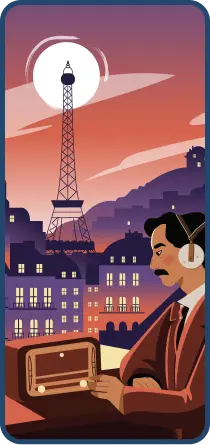
  &nbsp;&nbsp;&nbsp;&nbsp;
  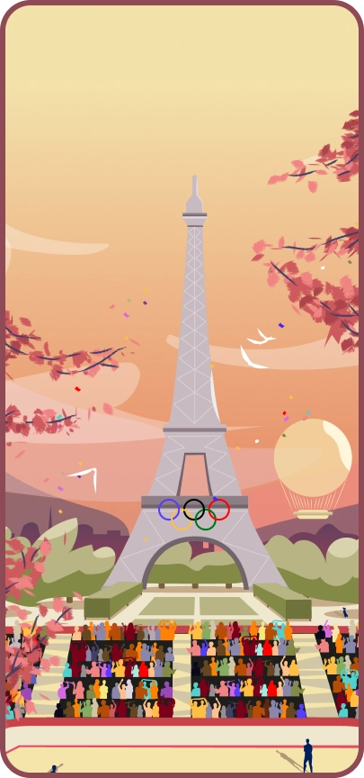

### Review the Story Together

We made the artistic choice of **no voiceovers**. This allows the music to carry the emotion and leaves space for dialogue between you and your child.

After the episode, a **scene-by-scene recap** lets you revisit key moments to ensure the story is fully understood.

 

  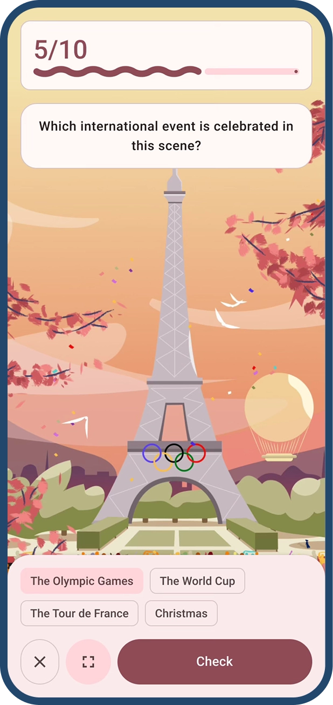

### Play Short Quizzes

Extend the experience with **short, playful quizzes**.

Each question is linked to a visual scene, helping to check understanding and spark meaningful discussion about what you just discovered.

 

  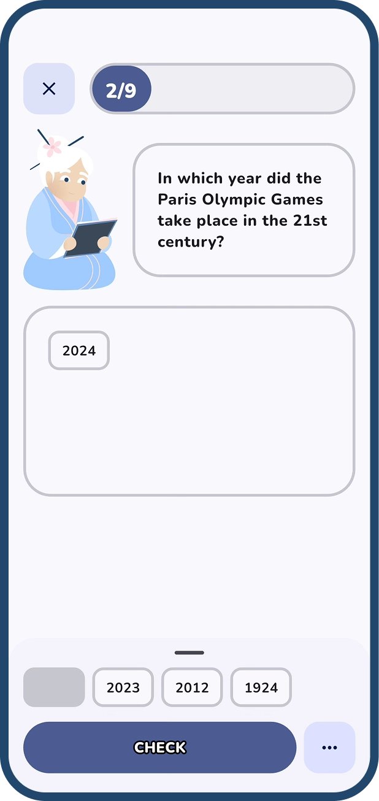
  &nbsp;&nbsp;&nbsp;&nbsp;
  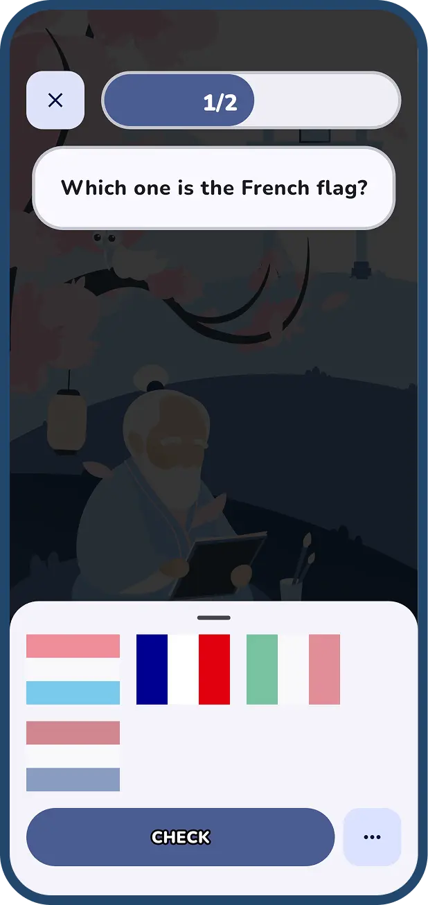

### Retain Knowledge Forever

To make learning last, Erudit uses **spaced repetition**.

Questions reappear at **smart intervals**, keeping cultural knowledge firmly anchored in your child’s memory.

 

  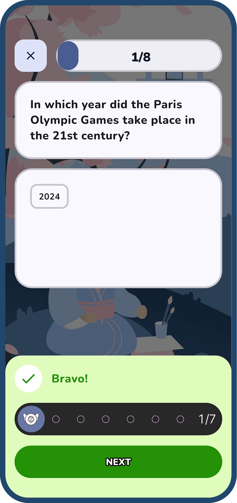

### Plan Your Real-Life Visit

Each story belongs to a **real place**.

With one tap, **locate the landmark** on your map to plan a family outing. Visiting in person **unlocks the site's story**, along with the **untold backstory of our characters**.

 

  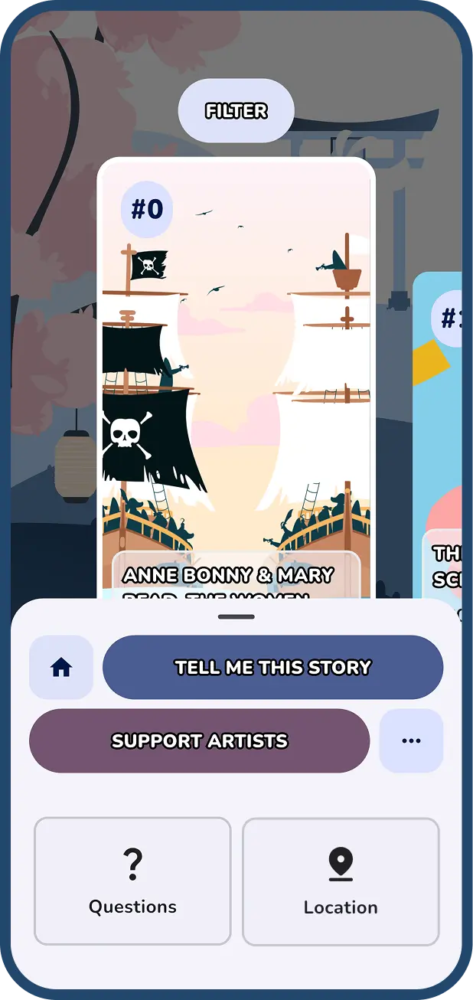

### Support Our Artists

We proudly **showcase our artists**.

Follow direct links to their websites to discover the talent behind the stories and **support their personal projects**.

 

  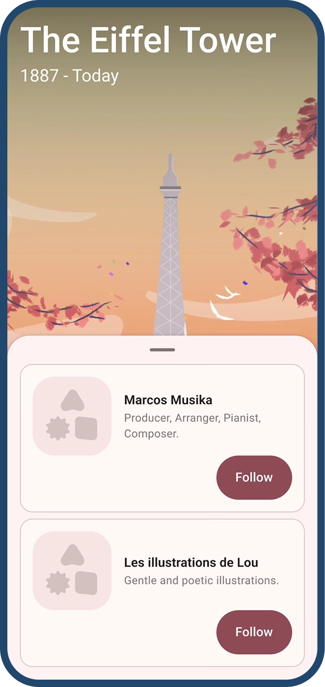

### Enjoy a Safe Experience

We respect your child’s attention. Erudit contains **no ads**, collects **no personal data**, and works **entirely offline**.

It is a safe, private space designed to nurture curiosity, not monetize time.

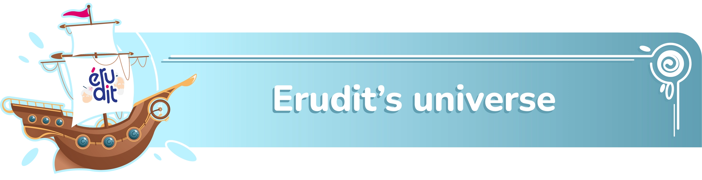

* **Eruh, the Storyteller:** Storytelling is his passion. His voice carries you away like a melody.
* **Hudit, the Keeper:** Gaming is her passion. She transforms key details into playful quizzes to lock the memory in.

Centuries ago, Eruh and Hudit belonged to a secret ancient order: **The Guardians of Knowledge**.
This order was sworn to protect the stories of the past, ensuring they would never fade away.

They believed that knowledge is a light for the future. A way to avoid past mistakes and pass on values of kindness, wisdom, and respect.

The members of this order possessed a **mysterious power**… but that is for you to discover!  

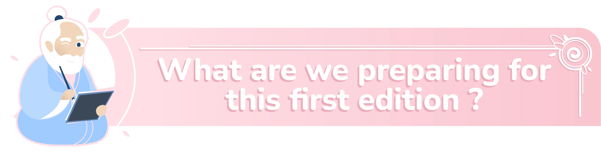

For this first edition, we begin our journey in **France**, dedicating one unique story to **each region**.

Every tale is brought to life by **local artists and composers**, ensuring the art and music reflect the true spirit of the place. We proudly showcase their talent through behind-the-scenes content and dedicated profiles in the app.

This is just the start. With your support, we plan to expand to **new countries**, letting the community **vote for the next destinations**.

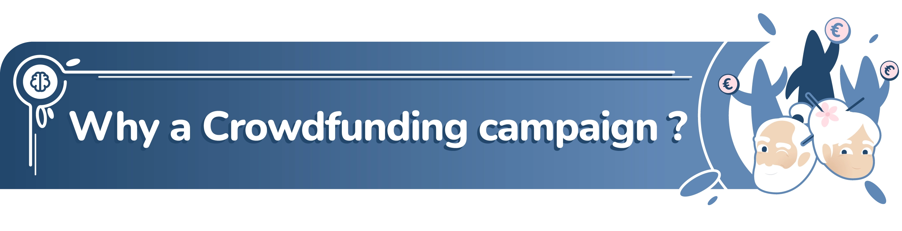

We chose **human craftsmanship** over shortcuts. We work with **real artists**, real hands, and real sensibilities. This approach is the heart of Erudit, but true quality requires resources.

We need you to **bring this vision to life**. Your support directly funds the production. It ensures our artists are fairly paid and that the project launches with the quality it deserves.

By backing us, you become a **co-producer**. You actively support the creative community and shape the future of Erudit.

[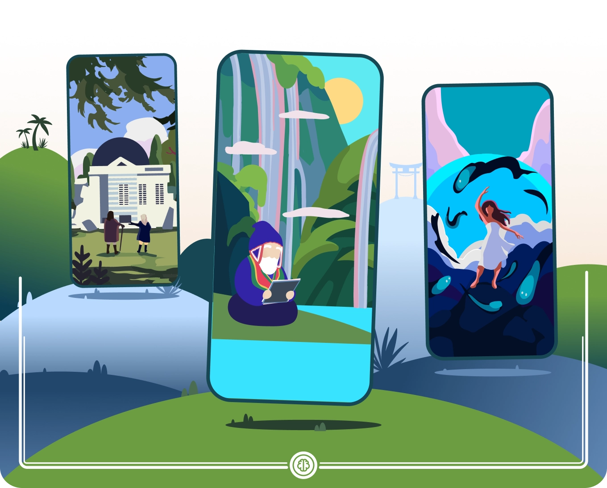](https://www.instagram.com/justine.ghyselen/)

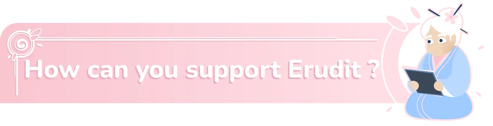

The founding team handles all writing, animation, and technical development in-house. Therefore, we are not requesting any funding for these stages.

Your contribution is **100% dedicated to artistic production**. It serves exclusively to remunerate the external talent bringing Erudit to life. Here is the real cost to produce a single animated story:

**Illustrator (€1,500)**
* Creation of a complete visual theme for the app.
* 4 scene illustrations.

**Composer (€300)**
* A bespoke composition to carry the emotion throughout the story.

---

* Fund the project according to your means. Your support will be rewarded with **unique perks**, and you will follow the production step by step.
* **Spread the word** about Erudit to friends, family, and colleagues, and **share our campaign on social media**. Every share is a huge help!

[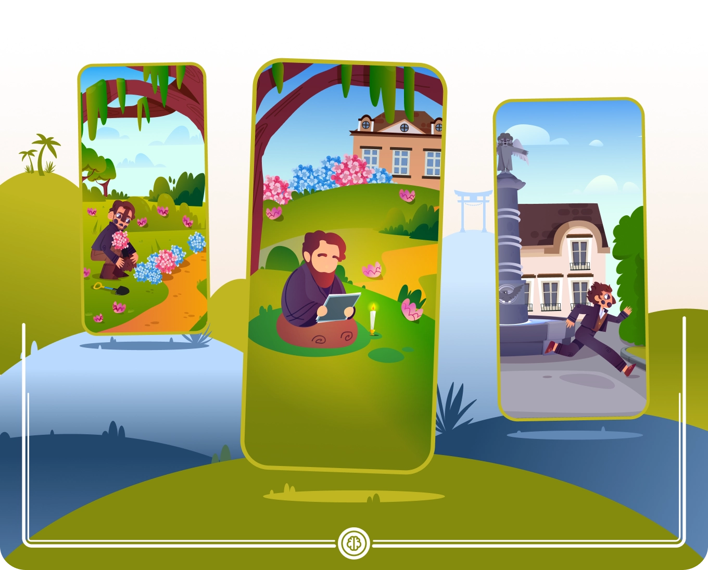](https://pollentoxique.myportfolio.com)

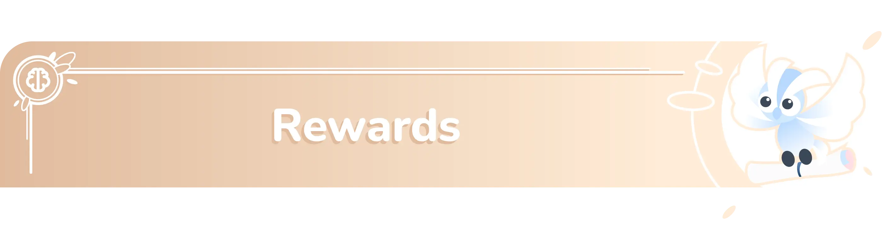

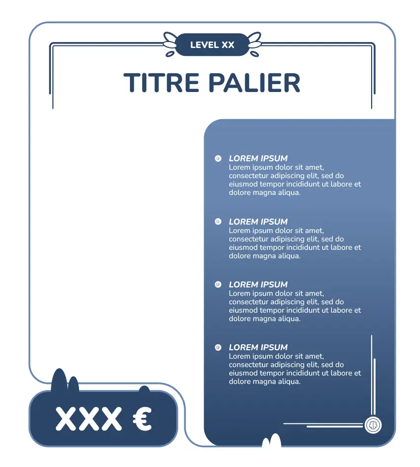

### Deckhand on Board
**Pledge: €5**

**Every journey begins with a first step.**  
By joining the crew, you help bring Erudit to life and support a new way of discovering history—calm, thoughtful, and made to last.

* **Official Digital Wallpaper**  
  An exclusive high-resolution illustration for mobile.
* **Thank You Shout-out**
  Your name listed in a special Thank You post in the project’s News section.
* **“Deckhand on Board” Badge**  
  A special badge showing you supported Erudit from the very beginning.

### Erudit – France Edition (Lifetime Access)
**Pledge: €30**

**The heart of the project.**  
This pledge gives you access to the complete **France edition** of Erudit, designed as a lasting cultural experience to explore at your own pace.

**Includes all previous rewards, plus:**

* **Lifetime Access to the France Edition**  
  Enjoy all animated stories from the France Edition, permanently. Unlock one story daily without scanning, perfect for when travel isn't possible. Just remember: visiting on-site still holds special rewards and exclusive content.
* **“Space Traveler” Badge**  
  A badge displayed in the app, marking you as one of the first explorers of Erudit.

### Guardians of Knowledge
**Pledge: €80**

**Take part in the making of history.**  
As a Guardian of Knowledge, you go beyond discovering stories: You help shape them, alongside the Erudit team.

**Includes all previous rewards, plus:**

* **Early App Access**  
  Discover new anecdotes in the app before the public release.
* **Digital Artbook — *The Making of Erudit***  
  A curated look at the creative process:  
  character design (Eruh & Hudit), environments, visual research, and artistic evolution.
* **Lifetime Access to All Background Themes from France Edition**  
  Unlock every visual theme from the France Edition.
* **A Collaborative Exclusive Anecdote**  
  Take part in the creation of a unique story by voting on the location, historical period, and main characters.  
  Your name (or your child’s name) will appear in the credits of this collaborative episode.
* **Shared Creative Decisions**  
  Depending on unlocked stretch goals, Guardians help decide which French regions and landmarks are explored.
* **Official Credits**  
  Your name featured in the credits of both the **Erudit app and the official website**.
* **“Guardian of Knowledge” Badge**  
  A distinguished badge shown in the app, honoring your role as a supporter and co-creator.

> *All rewards are 100% digital. No physical shipping involved.*

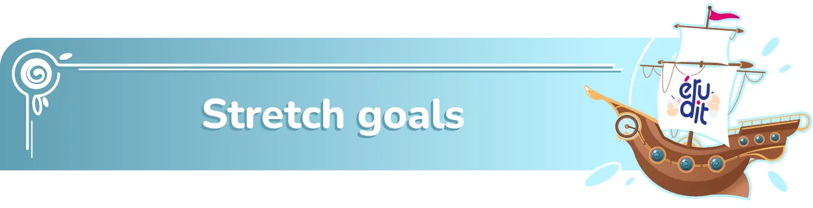

> Our goal is to bring **France Edition** to life, region by region. Each milestone adds **new animated anecdotes**, enriching the cultural journey for all backers.

### ✅ Base Goal – €10,000 (100% funded)
**Unlock 4 anecdotes**  
- 4 from **Île-de-France** (already in development)

This ensures the first edition is **complete and enjoyable**, even without additional stretch goals.

### 🔓 €30,000
**Unlock 3 additional anecdotes**  
- Expanding the journey to new regions  

### 🔓 €40,000
**Unlock 3 additional anecdotes**  
- Further expansion across France  

### 🔓 €50,000
**Unlock 3 additional anecdotes**  
- More regions added, enriching the cultural map of France

### 🔓 €60,000
**Unlock 3 additional anecdotes**  
- Approaching full coverage  

### 🔓 €70,000 – Full Edition
**Unlock the final 3 anecdotes**  
- **All 18 regions of France** are covered  
- Every story included, giving a complete France edition for all backers

> *Erudit is a complete and enjoyable experience even if only the base goal is reached.*
> The regions currently shown in the stretch goals are **placeholders**. As a **Guardian of Knowledge**, you will be invited to select the actual regions we explore. 

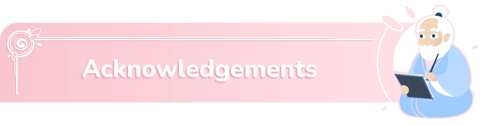

Thanks to all the amazing people who have collaborated on this project. You make our life a dream.

### Artists

#### Artistic direction

[KALM DESIGN](https://www.instagram.com/kaelem_design/)

#### Illustrators

- [lesillustrationsdelou](https://lesillustrationsdelou.com)
- [Justine Ghyselen](https://www.instagram.com/justine.ghyselen)
- [Fooxyla](https://www.fooxyla.com)
- [Pollen Toxique](https://pollentoxique.myportfolio.com/)

#### Composers

[Marcos](https://www.fiverr.com/marcos_musika2)

#### Animators

- [Bobazanim](https://bobaz.fr)
- [Lala](https://www.fiverr.com/lurie_/)

### Organizations

[Live for Good](https://www.live-for-good.org)
The movement of young entrepreneurs who are changing the world.

### Contributors

[Papi-Eruh](https://github.com/Papi-Eruh)

## Contact

* <https://erudit.app>
* <contact@erudit.app>

